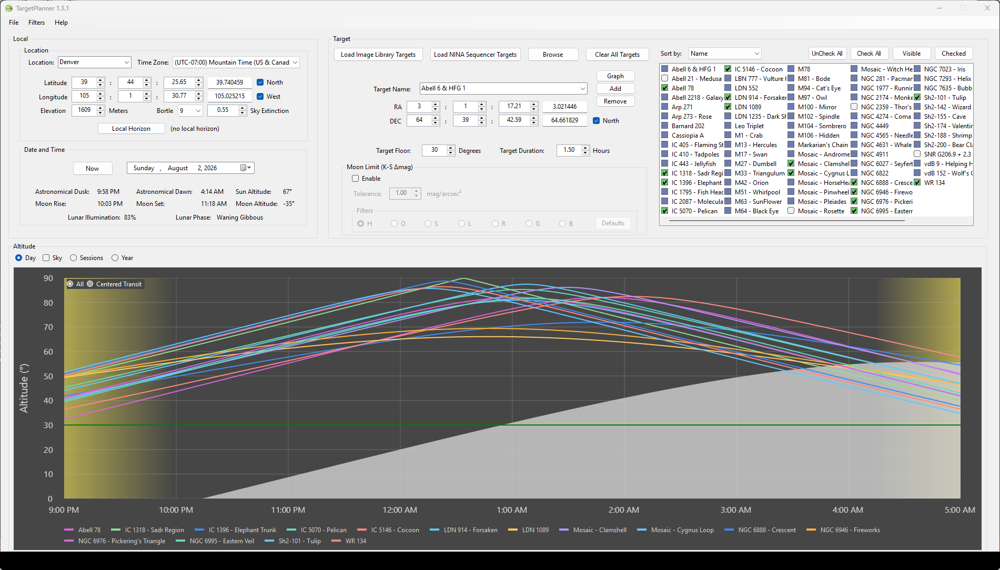
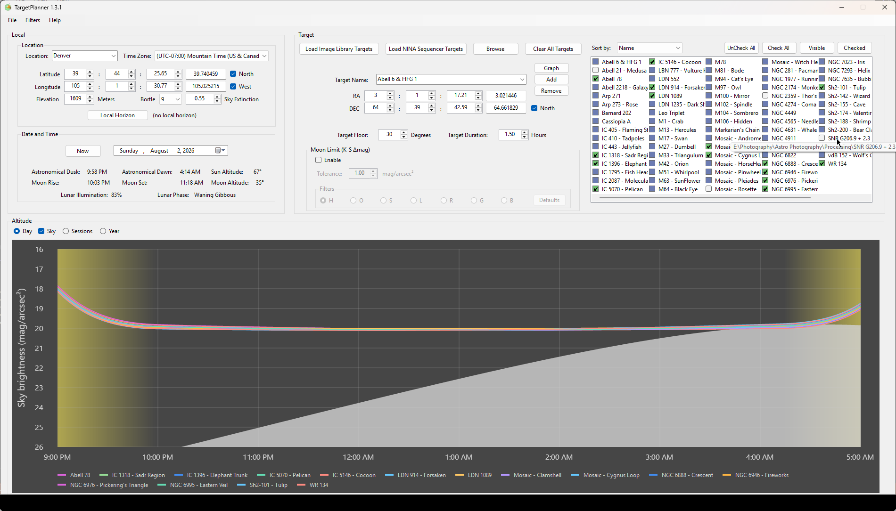
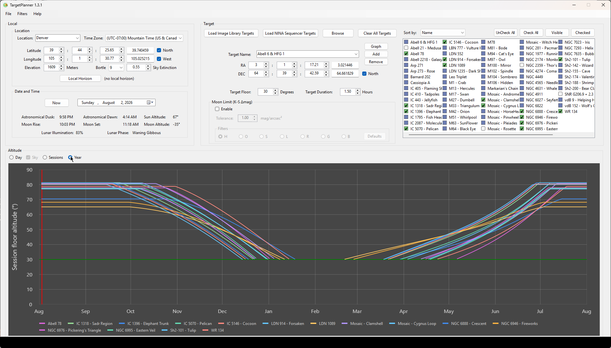

# TargetPlanner

Windows Forms desktop tool for astrophotography target planning. Plots a deep-sky target's altitude across a single night, scans a year for the best dates, and overlays multiple targets loaded from NINA sequence files or your `.xisf` image library.



## What it does

- **Four chart areas** — *Day* (minute-by-minute altitude across the coming night, with twilight shading and a live "now" line), *Sky* (Krisciunas–Schaefer sky brightness in mag/arcsec² across the same night), *Year* (per-night altitude across 12 months), *Sessions* (Ceiling / Floor / Symmetric placement curves per night).
- **Multi-target overlay** — graph many targets at once. Filter via *Visible* / *Check All* / *UnCheck All*; sort by name, transit time, rise time, longest session, or highest altitude.
- **Target ingestion** — load targets from NINA `.json` sequence files and `.xisf` images: the **Load** buttons scan your configured roots, **Browse** scans any file or folder, and you can drag files or folders onto the list. Loads add to the list and collapse duplicates — one entry per object even when it was imaged through many filters.
- **Picker-driven moment** — Date / Time pickers drive the observation moment; *Now* snaps back to the current instant and moves the red now-line on the chart.
- **Sky brightness** — its own chart area (peer of Day / Year / Sessions). Krisciunas–Schaefer sky brightness in mag/arcsec², with per-Bortle baseline, atmospheric extinction, and per-filter wavelength scaling.
- **Moon limit** — a per-filter K-S Δmag tolerance (how much moon-driven sky brightening is acceptable) gates the Sessions-chart curves and Day-chart best-window overlay.

## Charts

Four chart areas swap behind the **Day / Sky / Year / Sessions** radios beside the chart.

**Day chart.** Minute-by-minute altitude through the coming night. Left edge is the hour boundary before astronomical dusk; right edge is the hour boundary after astronomical dawn. Yellow→gray gradient at left marks dusk twilight; gray→yellow gradient at right marks dawn. A red vertical line shows the current moment, refreshed by the **Now** button. A shared gray filled area shows moon altitude across the night. Click a curve to overlay its best window for tonight (see *HD Overlay* below).

**Sky chart.** Per-target sky-brightness curves in mag/arcsec² on a reversed Y axis (brighter sky reads higher). Same time axis as Day. Y range is 16–26 mag/arcsec² (widened to cover narrowband K-S predictions, which run brighter than 22 at most Bortle classes). See [Sky brightness](#sky-brightness) below for the K-S model details.



**Year chart.** Per-night session-floor altitude across 12 months, one curve per target. X axis runs from the 1st of the current month to the 1st of the same month next year, with month-boundary tick labels. Hover any point: tooltip shows `{Target}\n{date}\nFloor: {alt}°`, falling back to a no-fit message for nights where no D-hour window meets the active Horizon / Duration / Moon filter, or a `(polar period)` note for nights inside a polar-day/polar-night span where the window can't be evaluated at all.



**Sessions chart.** Three per-target curves describe how well a Duration-long imaging window fits inside each night's visibility arc, given your Horizon floor:
- **Ceiling** — peak altitude reached inside any qualifying window.
- **Floor** — floor altitude of the best D-hour placement (transit-centred when it fits, wall-pushed otherwise).
- **Symmetric** — floor altitude of a strictly transit-centred placement; renders as `—` if a D-hour window can't fit symmetrically around transit.

Hover any of the three curves to see all three values for that night.

## Domain terms

- **HD Overlay** — the Day-chart's best-window step function. Bounded by **H**orizon (the Y floor) and **D**uration (the minimum window length). Click a target's Day curve to overlay; click again to restore. Right-click the chart to apply the overlay to every fitting target at once (or restore all if any are active) — apply-all enters "global mode" so newly-fitting targets pick up the overlay automatically when you scrub Horizon / Duration / MoonAvoidance. Per-target click still works in global mode and carves an exception for that target (toggle-off stays off across scrubs; click again to re-include).
- **D-hour window** — a contiguous span of length ≥ Duration that stays above Horizon. The "best D-hour window" is the highest-quality placement of such a window inside tonight's visibility arc.
- **Ceiling / Floor / Symmetric** — the three Sessions-chart curves (above).

## Chart interactions

- **Left-click a legend item** — toggle that target's curves on/off.
- **Left-click a Day curve** — overlay the HD step function (target's best window for tonight); a second click on the same curve restores it. Clicking again at the exact same pixel re-toggles the same target (no need to chase the curve after it's been replaced by the step shape).
- **Right-click anywhere on the chart** — apply the overlay to every fitting target at once if none are active, otherwise restore every replaced curve. The "apply all" gesture enters global mode so newly-fitting targets auto-acquire the overlay across H/D/M scrubs.
- **Hover any data point** — per-point tooltip with target, time/date, and value(s).

## Targets

Two selection modes:

- **Single mode** — combo + RA/Dec inputs drive one target at a time. No selection until a load completes (the image-library / NINA auto-load on startup picks the first sorted target); typing coordinates works before that. M31 survives only as the RA/Dec fallback used when nothing is selected.
- **Multi mode** — the checkbox listbox drives a set of targets. Checkboxes default to **none-checked** so you opt targets in rather than out.

### Loading targets

Targets come from two on-disk formats — NINA `.json` sequence files and `.xisf` images — through three buttons plus drag-and-drop:

- **Load Image Library Targets** / **Load NINA Sequencer Targets** scan your configured image-library / NINA roots. If a root is unset or empty you're prompted to browse for one, and the choice is saved.
- **Browse** — pick one or more files, or open a folder (scanned recursively); both formats at once.
- **Drag-and-drop** any mix of `.json` / `.xisf` files and folders from Explorer onto the target list — same as Browse.

Every load *adds* to the list rather than replacing it, so you can build a set from several sources. An object imaged through many filters — or a mosaic's panels — collapses to a single target, placed at the centre of all its frames. Comet folders are skipped. **Clear All Targets** empties the list; **Uncheck All** just clears the checkboxes.

*Visible* / *Check All* / *UnCheck All* filter the listbox; sort by name, transit time, rise time, longest session, or highest altitude. Click **Graph** to (re)render the chart — the chart panel is blank at launch until Graph is clicked.

## Locations

A combo of named locations drives lat / lon / elevation, time zone, and the per-location sky-brightness inputs. The combo is backed by `%AppData%\TargetPlanner\settings.json` — the single file holding all user state — seeded on a fresh install from the built-in presets in `PersonalDefaults.BuildSeedSettings()`.

Edit the saved sites — add, remove, retune — via **File ▸ Defaults ▸ Edit settings.json**, which opens the file in your default editor; relaunch TargetPlanner to load the changes. **File ▸ Defaults ▸ Clear (factory reset)** wipes settings.json — plus filters, local targets, and logs — back to the seed.

The **Custom** slot holds in-progress edits when you scrub the lat / lon / elevation / Bortle / extinction controls without saving.

Per-location fields:
- **Latitude / Longitude / Elevation** — the observer position.
- **Bortle class (1–9)** — drives the moonless dark-sky baseline V₀ used by the Sky-brightness overlay. Picking a class also pre-fills a typical extinction value.
- **Extinction *k*** at 500 nm (mag/airmass) — drives airmass attenuation in the Sky-brightness overlay.

**The last-selected location boots.** The app launches at whichever location you had selected when you last closed it (`settings.json`'s `LastSelectedLocationName`). On a fresh install with no prior state, `PersonalDefaults.BuildSeedSettings()` seeds this to "Penns Park" as a starting point — not a fixed personal default that returns on every launch. Pick any other saved location after start-up freely.

## Filters & moon avoidance

Filters serve two purposes: they pin the active wavelength for the Sky-brightness overlay (via centre-nm) and they carry the per-filter moon-limit tolerance (K-S Δmag; defaults: narrowband 1.0 mag ≈ sky ×2.5, broadband 0.30 mag ≈ sky ×1.32) used by the Sessions-chart curves and Day-chart HD overlay.

A master **Enable** checkbox in the Moon Avoidance group gates moon-avoidance globally. When off, all curves render moon-blind.

The filter library ships with (separation° / avoidance-days):
- **H** — narrowband, 30° / 5-day, line-centre wavelength.
- **O** — narrowband, 60° / 5-day, line-centre wavelength.
- **S** — narrowband, 30° / 5-day, line-centre wavelength.
- **L** — broadband, 90° / 10-day, Bessell-ish centre.
- **R** — broadband, 60° / 10-day, Bessell-ish centre.
- **G** — broadband, 60° / 10-day, Bessell-ish centre.
- **B** — broadband, 90° / 10-day, Bessell-ish centre.

Two parallel filter-selection surfaces stay in sync: a **Filters** dropdown in the menubar, and a radio strip beside the tolerance control.

- **Right-click any filter** (menu item or radio) — opens the Edit Filters dialog pre-positioned on that filter. Add / Remove / per-row Defaults restore.
- A **Defaults** button beside the filter strip restores **all** built-in filters to factory defaults (custom tuning on every library filter is reset, not just the active one).
- A trailing `*` on a filter's name indicates it differs from the shipped factory defaults; the top-level **Filters** menu shows `*` if any filter is modified.

Tolerance edits on the main form auto-save the active filter on a 500 ms debounce; the Edit Filters dialog uses a transactional Save against a shadow copy.

## Sky brightness

Click the **Sky** radio (peer of Day / Year / Sessions) to switch to the per-target sky-brightness chart in mag/arcsec². The Y axis range is 16–26 mag/arcsec² with brighter sky reading higher.

Sky brightness composes three contributions in linear (nanolambert) space:
- **Dark-sky baseline** V₀ — driven by the location's Bortle class, scaled by target airmass and extinction.
- **Solar twilight** — quadratic empirical ramp from 0 (at astronomical dusk/dawn, sun ≤ −18°) up to ~10 mag of brightening at sunset (sun = 0°). Zero through the dark middle of the night.
- **Moon contribution** — Krisciunas–Schaefer 1991 closed-form. Zero when moon is below horizon; spikes brightness around moonrise/moonset and stays bright through moon-up nights.

Hover any point on a Sky curve: tooltip shows `{time}\n{sky:0.0} mag/arcsec²`. The active filter's centre wavelength scales atmospheric extinction via Rayleigh λ⁻⁴ — switching from B (445 nm) to Hα (656 nm) shifts curves toward darker sky during moon-up periods.

## Time controls

Date and Time pickers hold the observation moment and drive every chart and label. **Now** snaps the pickers to the current instant and refreshes the red now-line on the Day chart. There's no auto-update timer — the moment moves only when you move it.

## Install

Download `TargetPlanner-win-Setup.exe` from the [latest release](https://github.com/Apoplectic1/TargetPlanner/releases/latest). The installer drops the app into `%LocalAppData%\TargetPlanner` with Start Menu / Desktop shortcuts and an Apps & Features entry.

The installer is unsigned, so Windows SmartScreen will warn on first launch. Click *More info → Run anyway*.

## Updates

The app checks for updates on startup and prompts before downloading. You can also trigger a check manually via *Help → Check for Updates...*. Updates are delivered as Velopack delta packages from GitHub Releases.

## Build from source

Requires Visual Studio 2022+ (or the .NET 10 SDK + MSBuild) plus the **Astronomy.Core** library, referenced via `ProjectReference`. The Library is its own git repo; clone it as a sibling of this repo (`..\Library\` next to `TargetPlanner\`) or the build fails.

The TP project targets `net10.0-windows10.0.19041` (the Win10 2004 contract version is required for SkiaSharp.Views.WindowsForms 3.119.0 — the bare `net10.0-windows` would fall back to a `net462` lib that doesn't load on .NET 10). See [`CLAUDE.md`](CLAUDE.md) for architecture and coding-agent guidance.

```powershell
dotnet build TargetPlanner.sln -c Debug
```

Or open `TargetPlanner.sln` in Visual Studio and F5.

## Defaults

First-run defaults are seeded into `settings.json` from `PersonalDefaults.BuildSeedSettings()` — a C# factory (see [Locations](#locations)):

- Default target: none — Single mode has no selection until a load completes and auto-picks the first sorted target; **M31** survives only as the RA/Dec fallback used when nothing is selected.
- Default location: the last-selected site (`settings.json`'s `LastSelectedLocationName`, seeded on first run to "Penns Park"). TargetPlanner relaunches onto whatever site you last picked.
- Default selection in Multi mode: **none checked** after a NINA load.
- NINA targets root: `settings.json`'s `NinaTargetsRoot`, seeded on first run; `MainForm.NinaTargetsRootPath` is the single read-site.

## More documentation

- [`CLAUDE.md`](CLAUDE.md) — coding-agent guidance: high-level architecture, conventions, glossary, Core consumer contract.
- [`ARCHITECTURE.md`](ARCHITECTURE.md) — deep architecture reference: cache store, sub-chart wiring, universal chart-behaviour contract, moon avoidance, K-S sky brightness, MainForm UI flow.
- [`RELEASING.md`](RELEASING.md) — how to cut a new release.
- [`ROADMAP.md`](ROADMAP.md) — currently open follow-ups and recently shipped work.
